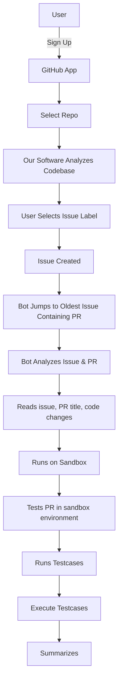

# 🤖 AutoPR Sentinel

AI GitHub Maintainer Bot is an intelligent assistant designed to automate tasks typically handled by open-source maintainers. It reviews pull requests, generates tests, triages issues, and merges code automatically using GitHub APIs and AI — reducing maintainer burnout and speeding up contributions.

---

## 📖 Story

Maintaining open-source projects is tough—contributors come and go, but maintainers stay buried under pull requests, bugs, and burnout. This project was born to change that. We envisioned an AI-powered maintainer that doesn't sleep: one that understands code, reviews PRs, runs tests, and merges clean contributions automatically. The AI GitHub Maintainer Bot is our way of helping projects grow, stay active, and welcome contributions—without overwhelming maintainers.

---

## Demo UI

visit : [Landing Page](https://passionate-seat-044305.framer.app/)

---

## 🚀 Features

-🔍 Code Review-
    Analyze PR diffs and compare with the existing codebase.
    Suggest improvements or approve PRs using AI.
-✅ Auto-Merge PRs
    If PR passes all CI checks and is approved, auto-merge via GitHub REST API.
    Support squash, rebase, or merge commits.
-🧪 Test Generation
    Use AI to generate basic unit/integration tests.
    Run tests and verify functionality before merging.
-🗂️ Issue Triage
    Auto-label issues based on content.
    Close duplicates or invalid issues.
    Prioritize bugs and enhancements.
-📦 Release Management
    Tag versions and auto-generate changelogs.
-🗞️ Documentation Upkeep
    Suggest improvements to README, CONTRIBUTING.md, etc.
-🧠 AI Assistance
    LLM-based summaries of PRs.
    Suggested code improvements inline

---

## 🛠 Tech Stack

- **Frameworks & Libraries**: Next.js, Probot  
- **AI & Automation**: Gemini, Auto-GPT  
- **Languages**: Python, TypeScript, JavaScript  
- **Databases & Caching**: MongoDB, Redis  
- **DevOps & Runtime**: Docker, Sandbox Environments  
- **Integrations & APIs**: Webhooks, REST API  
- **Code Quality & Standards**: ESLint  

---

## 📈 Business Plan

**Target Market**  
- Open-source projects (with 5+ contributors)  
- Indie maintainers & small dev teams  
- Startups (1–10 engineers)  
- Enterprises with internal GitHub usage  
**Market Segments**  
- Free users (OSS visibility)  
- Paid SaaS (private repo automation)  
- Enterprise clients  
**Revenue Model**  
Free Tier (For Public Repos):
  Includes basic AI review, PR auto-labeling, unit test checks, and weekly summaries for up to 100 PRs/month — ideal for students and open-source users.
Developer Plan ($9/mo):
  Full LLM-based PR reviews, auto-merge with squash/rebase, PR classification, and container-based test runs.
Team Plan ($39/mo):
  All Developer features plus private repo support, changelog generation, contributor analytics, and Slack/Discord integration for up to 10 repos.
Enterprise Plan (Custom):
  Self-hosted version with SSO, security compliance, internal API access, and premium support with SLA.  
---

## 🔁 Workflow

🧑‍💻 A Developer Submits a Pull Request (PR)
→ The contributor opens a PR in a GitHub repository.
📡 Bot Gets Triggered via GitHub Webhook
→ The AI Bot listens for pull_request events and activates.
🔍 Code Review Using AI
→ The bot analyzes the PR using a lightweight or full LLM.
→ Checks for code quality, style, and guideline compliance.
🧪 Test Generation & Execution
→ The bot auto-generates tests (if needed).
→ It runs them in a sandbox or via GitHub Actions.
✅ Decision Phase
→ If all tests pass and review is clean:
It auto-approves the PR.
Rebases/squashes and merges via GitHub REST API.
🗂️ Issue Handling (optional background task)
→ Bot auto-labels new issues, closes duplicates, and categorizes them.
📦 Post-Merge Automation
→ Tags the release, updates changelog, and posts a summary.
---

## 📄 License

MIT © 2025
