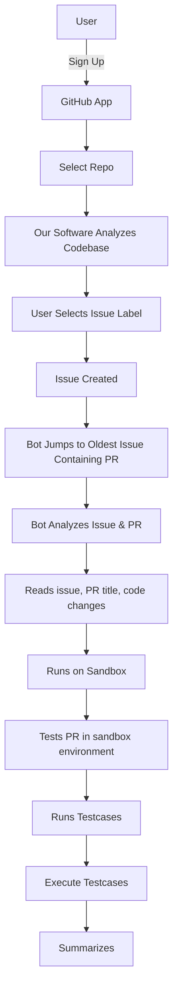

# 🤖 AutoPR Sentinel

AutoPR Sentinel is an AI-powered GitHub bot designed to streamline the pull request (PR) review process in open-source and team-based projects. It ensures every incoming PR adheres to the project’s code style, structure, and standards — before even touching the main branch.

---

## 📖 Story

Open-source maintainers and small dev teams often struggle with a flood of inconsistent pull requests that don’t follow established coding patterns, leading to burnout and slow development. AutoPR Sentinel solves this by acting as an automated reviewer — it scans your codebase, learns your style, and flags any mismatches in PRs. From naming conventions to architecture decisions, the bot ensures every PR aligns with your project’s DNA. Once a PR passes style and quality checks, it’s auto-tested in a sandbox — no human effort wasted on broken or misaligned contributions.

---

## 🚀 Features

- 🔍 Scans entire codebase and builds a vector-based memory
- 🧠 Uses Gemini AI to review PRs against existing code style
- ✅ Flags PRs that match standards and auto-runs test cases
- 🧪 Executes test cases in a sandbox environment
- 💬 Summarizes result for maintainers with pass/fail verdict

---

## 🛠 Tech Stack

- **Frameworks & Libraries**: Next.js, Probot  
- **AI & Automation**: Gemini, Auto-GPT  
- **Languages**: Python, TypeScript, JavaScript  
- **Databases & Caching**: MongoDB, Redis  
- **DevOps & Runtime**: Docker, Sandbox Environments  
- **Integrations & APIs**: Webhooks, REST API  
- **Code Quality & Standards**: ESLint  

---

## 📈 Business Plan

**Target Market**  
- Open-source projects (with 5+ contributors)  
- Indie maintainers & small dev teams  
- Startups (1–10 engineers)  
- Enterprises with internal GitHub usage  

**Market Segments**  
- Free users (OSS visibility)  
- Paid SaaS (private repo automation)  
- Enterprise clients  

**Revenue Model**  
Hybrid model (Free + Premium)  
- 🟡 Free Plan – Public repos, basic PR tools  
- 🟢 Pro Plan – $19/mo, includes private repo support  
- 🔵 Team Plan – $99/mo, supports multiple repos  
- 🔷 Enterprise – Custom pricing with full control & support  

---

## 🔁 Workflow

---

## 🤝 Contributing

We welcome contributions! Check our `CONTRIBUTING.md` for coding style, test conventions, and PR guidelines.

---

## 📄 License

MIT © 2025
